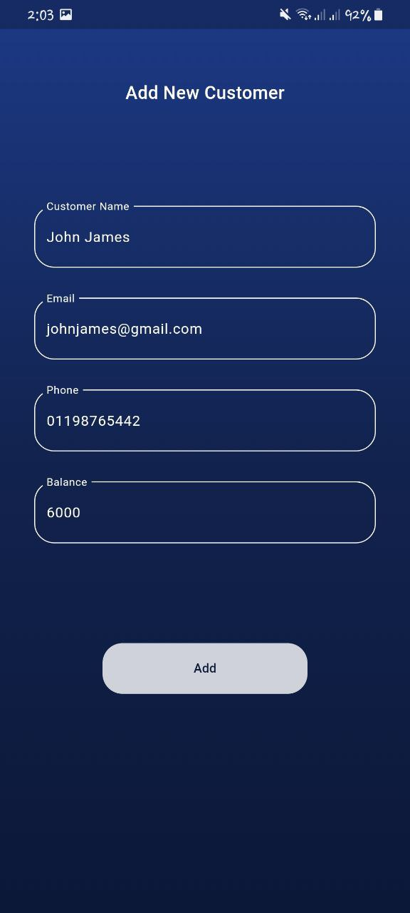

<p align="center">
  
</p>

# Basic Bank

## Content
 - [Description](#description)
 - [Features](#features)
 - [Tools](#tools)
 - [Screenshots](#screenshots)
 - [APK Path ](#apk-path )


# Description

A simple banking app built with Flutter and Dart, utilizing SQLite for local database management. The app allows users to transfer money between accounts, view transfer history, and check the total balance.


## Features

- Money Transfers: Easily transfer money between accounts with a user-friendly interface.
- Transfer List: View a list of all transactions, including details like amount, sender, and recipient.
- Total Balance: Check the total balance across all accounts to keep track of funds.
- SQLite Integration: Local database management for storing and retrieving transaction data..


## Tools


[](https://www.sqlite.org/)


# Screenshots

<p align="center">
  
  
</p>

<p align="center">
  
  
</p>

<p align="center">
  
  
</p>


<p align="center">
  
  
</p>


## Deployment

To deploy this project run this command in terminal

```bash
 flutter build apk
```

## APK Path 
build/app/outputs/flutter-apk/app-release.apk
